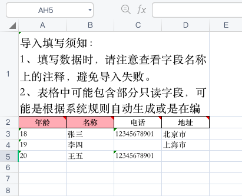
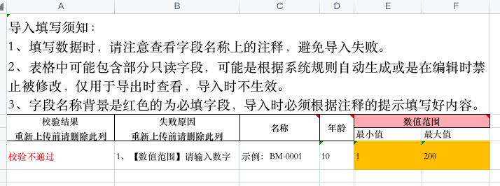

# ExcelAlchemy 使用指南

# 📊 ExcelAlchemy

ExcelAlchemy 是一个用于从 Minio 下载 Excel 文件，解析用户输入并生成对应 Pydantic 类的 Python 库，同时也可以将 Pydantic 数据生成对应的 Excel，便于用户下载。

## 安装

在使用该库前，请先安装以下依赖：

- Python 3.6+
- Pydantic
- openpyxl
- minio

使用 pip 安装：

```
pip install ExcelAlchemy
```

## 使用方法

### 从 Pydantic 类生成 Excel 模板

```python
from excelalchemy import ExcelAlchemy, FieldMeta, ImporterConfig, Number, String
from pydantic import BaseModel


class Importer(BaseModel):
    age: Number = FieldMeta(label='年龄', order=1)
    name: String = FieldMeta(label='名称', order=2)
    phone: String | None = FieldMeta(label='电话', order=3)
    address: String | None = FieldMeta(label='地址', order=4)

alchemy = ExcelAlchemy(ImporterConfig(Importer))
base64content = alchemy.download_template()
print(base64content)

```
* 上面是一个简单的例子，从 Pydantic 类生成 Excel 模板，Excel 模版中将会有一个 Sheet，Sheet 名称为 `Sheet1`，并且会有四列，分别为 `年龄`、`名称`、`电话`、`地址`，其中 `年龄`、`名称` 为必填项，`电话`、`地址` 为可选项。
* 返回一个 base64 编码的 Excel 字符串，可以直接在前端页面中使用 `window.open` 方法打开 Excel 文件，或者在浏览器地址栏中输入 base64content，即可下载 Excel 文件。
* 在下载模版时，您也可以指定一写默认值，例如：

```python
from excelalchemy import ExcelAlchemy, FieldMeta, ImporterConfig, Number, String
from pydantic import BaseModel


class Importer(BaseModel):
    age: Number = FieldMeta(label='年龄', order=1)
    name: String = FieldMeta(label='名称', order=2)
    phone: String | None = FieldMeta(label='电话', order=3)
    address: String | None = FieldMeta(label='地址', order=4)


alchemy = ExcelAlchemy(ImporterConfig(Importer))
sample = [
    {'age': 18, 'name': '张三', 'phone': '12345678901', 'address': '北京市'},
    {'age': 19, 'name': '李四', 'address': '上海市'},
    {'age': 20, 'name': '王五', 'phone': '12345678901'},
]
base64content = alchemy.download_template(sample)
print(base64content)
```

* 上面的例子中，我们指定了一个 `sample`，`sample` 是一个列表，列表中的每个元素都是一个字典，字典中的键为 Pydantic 类中的字段名，值为该字段的默认值。
* 最终下载的 Excel 文件中，`Sheet1` 中的第一行为字段名，第二行开始为默认值，如果某个字段没有默认值，则该字段为空，如图所示：
* 

### 从 Excel 解析 Pydantic 类并创建数据

```python
import asyncio
from typing import Any

from excelalchemy import ExcelAlchemy, FieldMeta, ImporterConfig, Number, String
from minio import Minio
from pydantic import BaseModel


class Importer(BaseModel):
    age: Number = FieldMeta(label='年龄', order=1)
    name: String = FieldMeta(label='名称', order=2)
    phone: String | None = FieldMeta(label='电话', order=3)
    address: String | None = FieldMeta(label='地址', order=4)


def data_converter(data: dict[str, Any]) -> dict[str, Any]:
    """自定义数据转换器, 在这里，你可以对 Importer.dict() 的结果进行转换"""
    data['age'] = data['age'] + 1
    data['name'] = {"phone": data['phone']}
    return data


async def create_func(data: dict[str, Any], context: None) -> Any:
    """你定义的创建函数"""
    # do something to create data
    return True


async def main():
    alchemy = ExcelAlchemy(
        ImporterConfig(
            create_importer_model=Importer,
            creator=create_func,
            data_converter=data_converter,
            minio=Minio(endpoint=''),  # 可访问的 minio 地址
            bucket_name='excel',
            url_expires=3600,
        )
    )
    result = await alchemy.import_data(input_excel_name='test.xlsx', output_excel_name="test.xlsx")
    print(result)


asyncio.run(main())
```

* 倒入功能的文件基于 Minio，因此在使用该功能前，你需要先安装 Minio，并且在 Minio 中创建一个 bucket，用于存放 Excel 文件。
* 倒入的 Excel 文件，必须是从 `download_template` 方法生成的 Excel 文件，否则会产生解析错误。
* 上面的示例代码中，我们定义了一个 `data_converter` 函数，该函数用于对 `Importer.dict()` 的结果进行转换，最终返回的结果将会作为 `create_func` 函数的参数。当然，此函数是可选的，如果你不需要对数据进行转换，可以不定义该函数。
* `create_func` 函数用于创建数据，该函数的参数为 `data_converter` 函数的返回值，`context` 为 `None`，你可以在该函数中对数据进行创建，例如，你可以将数据存入数据库中。
* `import_data` 方法的参数 `input_excel_name` 为 Excel 文件在 Minio 中的名称，`output_excel_name` 为解析结果 Excel 文件在 Minio 中的名称，该文件包含所有输入的数据，如果某条数据解析失败，则在该条数据的第一列中会有错误信息，并且会讲产生错误的单元格标红。
*  返回 ImportResult 类型的结果，您可以在代码中查看该类的定义，该类包含了解析结果的所有信息，例如，成功导入的数据条数、失败的数据条数、失败的数据等。

一个倒入结果的示例, 如图所示：
* 


## 贡献

如果你在使用 ExcelAlchemy 过程中遇到了问题或者有任何建议，欢迎在 [GitHub Issues](https://github.com/username/repo/issues) 中提出。我们也非常欢迎你提交 Pull Request，贡献你的代码。

## 许可证

ExcelAlchemy 使用 MIT 许可证。详细信息请参阅 [LICENSE](https://github.com/username/repo/blob/main/LICENSE)。
## 贡献

如果你在使用 ExcelAlchemy 过程中遇到了问题或者有任何建议，欢迎在 [GitHub Issues](https://github.com/SundayWindy/ExcelAlchemy/issues) 中提出。我们也非常欢迎你提交 Pull Request，贡献你的代码。

## 许可证

ExcelAlchemy 使用 MIT 许可证。详细信息请参阅 [LICENSE](https://github.com/SundayWindy/ExcelAlchemy/blob/master/LICENSE)。